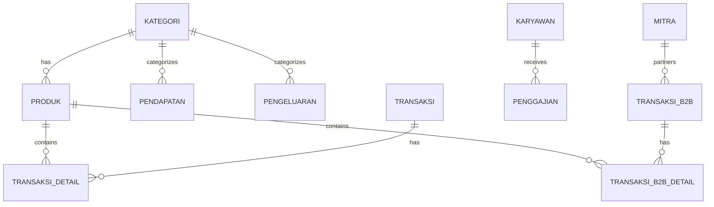

<p align="center">
  
</p>

<h1 align="center">Accellabs ERP</h1>

<p align="center">
  <strong>Sistem ERP Mini Modern untuk Manajemen Bisnis Terintegrasi</strong>
</p>

<p align="center">
  
  
  
  
  
</p>

---

## 📖 Tentang Project

**Accellabs ERP** adalah sistem Enterprise Resource Planning (ERP) berbasis web yang dirancang khusus untuk bisnis skala kecil hingga menengah. Dibangun dengan teknologi modern, aplikasi ini menyediakan dashboard interaktif untuk mengelola keuangan, inventaris, karyawan, dan transaksi B2B dalam satu platform terintegrasi.

Aplikasi ini mendukung mode **demo lokal** menggunakan file-based JSON database, sehingga dapat dijalankan tanpa memerlukan koneksi ke layanan eksternal.

---

## ✨ Fitur Utama

| Modul | Deskripsi |
|---|---|
| 📊 **Dashboard** | Ringkasan keuangan real-time dengan chart interaktif (Pendapatan vs Pengeluaran 6 bulan) |
| 💰 **Manajemen Keuangan** | Pencatatan pendapatan & pengeluaran dengan kategorisasi dan metode pembayaran |
| 🛒 **POS Kasir** | Sistem Point of Sale untuk transaksi harian retail |
| 🚚 **POS Invoice B2B** | Sistem invoicing khusus transaksi Business-to-Business dengan dukungan DP, ongkir, dan retur |
| 📦 **Manajemen Produk** | Kelola inventaris produk, stok, harga, dan kategori |
| 🤝 **Manajemen Mitra** | Data mitra bisnis (Reseller, Agen, Maklon) dengan kontak WhatsApp |
| 🧾 **Data Tagihan** | Tracking status pembayaran dan pengiriman transaksi B2B |
| 👥 **SDM / Karyawan** | Manajemen data karyawan dengan posisi dan status |
| 💵 **Penggajian** | Proses penggajian otomatis (gaji pokok, tunjangan, potongan, bonus) |
| 📄 **Laporan** | Laporan keuangan terstruktur dengan export Excel (XLSX) |
| 🔐 **Manajemen Akun** | Role-based access control (Master, Karyawan) |
| 🧾 **Cetak Struk & Invoice** | Halaman cetak struk POS dan invoice B2B |

---

## 🛠️ Tech Stack

### Core
- **Framework:** [Next.js 16.1.6](https://nextjs.org/) (App Router + Turbopack)
- **Runtime:** React 19.2.3 + TypeScript 5
- **Styling:** [Tailwind CSS 4](https://tailwindcss.com/) + [tw-animate-css](https://github.com/Wombosvideo/tw-animate-css)

### UI Library
- **Component System:** [shadcn/ui](https://ui.shadcn.com/) (Radix UI primitives)
- **Icons:** [Lucide React](https://lucide.dev/)
- **Charts:** [Recharts 3](https://recharts.org/)
- **Notifications:** [Sonner](https://sonner.emilkowal.dev/)
- **Theme:** [next-themes](https://github.com/pacocoursey/next-themes) (dark mode support)

### Data & Backend
- **Database Lokal:** File-based JSON (`dummy_db.json`)
- **Auth Provider:** [Supabase Auth](https://supabase.com/) (opsional, untuk mode production)
- **Validasi:** [Zod 4](https://zod.dev/)
- **Export:** [SheetJS (xlsx)](https://sheetjs.com/) untuk export Excel

---

## 📂 Struktur Project

```
erp/
├── public/                     # Aset statis (logo, service worker)
├── src/
│   ├── actions/                # Server Actions
│   │   ├── auth.ts             # Autentikasi (login/logout/register)
│   │   └── data.ts             # CRUD operations untuk semua modul
│   ├── app/
│   │   ├── page.tsx            # Landing page
│   │   ├── layout.tsx          # Root layout
│   │   ├── globals.css         # Global styles & design tokens
│   │   ├── login/              # Halaman login
│   │   ├── register/           # Halaman registrasi
│   │   ├── invoice/            # Cetak invoice B2B
│   │   ├── struk/              # Cetak struk POS
│   │   └── dashboard/
│   │       ├── page.tsx        # Dashboard utama
│   │       ├── layout.tsx      # Sidebar navigation
│   │       ├── chart.tsx       # Chart component
│   │       ├── pendapatan/     # Modul pendapatan
│   │       ├── pengeluaran/    # Modul pengeluaran
│   │       ├── pos/            # POS Kasir
│   │       ├── pos-b2b/        # POS Invoice B2B
│   │       ├── produk/         # Manajemen produk
│   │       ├── mitra/          # Manajemen mitra
│   │       ├── tagihan/        # Data tagihan
│   │       ├── karyawan/       # Manajemen karyawan
│   │       ├── penggajian/     # Modul penggajian
│   │       ├── laporan/        # Laporan keuangan
│   │       └── akun/           # Manage akun (Master only)
│   ├── components/
│   │   └── ui/                 # shadcn/ui components (21 komponen)
│   ├── hooks/
│   │   └── use-mobile.ts       # Hook deteksi mobile viewport
│   └── lib/
│       ├── db.ts               # Database layer (file-based JSON)
│       ├── types.ts            # TypeScript type definitions
│       ├── format.ts           # Formatter (Rupiah, tanggal, dll.)
│       ├── export.ts           # Utility export data
│       ├── utils.ts            # Utility helpers (cn)
│       └── supabase/           # Supabase client (server & browser)
├── dummy_db.json               # Local JSON database
├── components.json             # shadcn/ui config
├── next.config.ts              # Next.js configuration
├── tsconfig.json               # TypeScript configuration
└── package.json
```

---

## 🚀 Getting Started

### Prerequisites

- **Node.js** ≥ 20.x
- **pnpm** ≥ 10.x (direkomendasikan)

### Instalasi

```bash
# 1. Clone repository
git clone <repository-url>
cd erp

# 2. Install dependencies
pnpm install

# 3. Jalankan development server
pnpm dev
```

Buka [http://localhost:3000](http://localhost:3000) di browser.

### Mode Demo (Lokal)

Aplikasi sudah dikonfigurasi untuk berjalan dalam mode demo menggunakan **file-based JSON database** (`dummy_db.json`). Tidak diperlukan setup database eksternal. Data dummy akan otomatis di-generate saat pertama kali dijalankan.

### Mode Production (Supabase)

Untuk menggunakan Supabase sebagai backend:

```bash
# Buat file .env.local
cp .env.example .env.local

# Isi dengan kredensial Supabase
NEXT_PUBLIC_SUPABASE_URL=your_supabase_url
NEXT_PUBLIC_SUPABASE_ANON_KEY=your_supabase_anon_key
```

---

## 📜 Scripts

| Command | Deskripsi |
|---|---|
| `pnpm dev` | Menjalankan development server (Turbopack) |
| `pnpm build` | Build production bundle |
| `pnpm start` | Menjalankan production server |
| `pnpm lint` | Menjalankan ESLint |

---

## 🔑 Role & Hak Akses

Sistem menggunakan **Role-Based Access Control (RBAC)** dengan dua level:

| Role | Hak Akses |
|---|---|
| **Master** | Akses penuh ke semua modul termasuk manajemen akun, dashboard, laporan, dan konfigurasi |
| **Karyawan** | Akses terbatas: Pendapatan, Pengeluaran, dan POS Kasir saja |

---

## 🗄️ Data Model

Aplikasi mengelola entitas-entitas berikut:



---

## 🎨 Design System

- **Color Theme:** Blue/White dengan skema profesional
- **Typography:** [Geist Font](https://vercel.com/font) (otomatis via `next/font`)
- **Component Library:** shadcn/ui dengan Radix UI primitives
- **Responsive:** Mendukung mobile, tablet, dan desktop
- **Dark Mode:** Dukungan tema gelap via `next-themes`

---

## 📝 Catatan Pengembangan

- Aplikasi menggunakan **Next.js App Router** dengan pola **Server Components** dan **Server Actions** untuk operasi data.
- Database lokal menggunakan file JSON yang di-read/write secara sinkron via `fs` module di server side.
- Semua format angka menggunakan format **Rupiah (IDR)**.
- Bahasa antarmuka utama adalah **Bahasa Indonesia**.

---

## 📄 Lisensi

Project ini bersifat **private** dan dimiliki oleh **Accellabs**.

---

<p align="center">
  Dibuat dengan ❤️ oleh <strong>Accellabs</strong>
</p>
